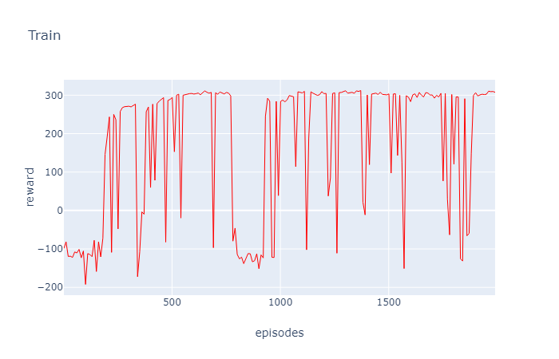
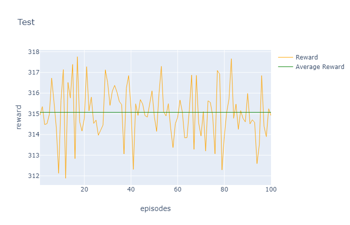

# TD3
The implementation of the TD3 algorithm was tested on the BipedalWalker environment.

The model training took 2000 epochs. This amount of epochs turned out to be excessive.

## The training plot with a step of 10 epoch

The trained agent was run through 100 trials and achieved an average reward of 315.0710446075174. 
The mean squared error was 1.2629194360001925

## The testing plot of the trained agent over 100 trials

